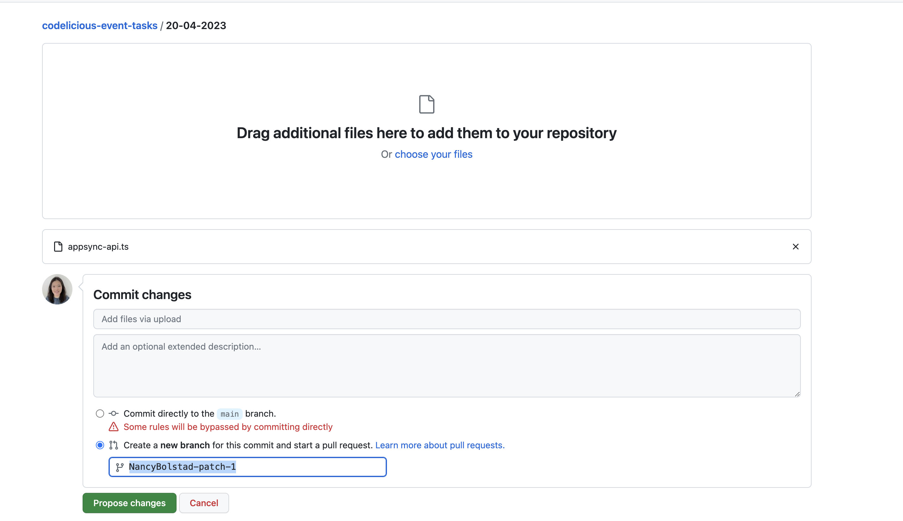

# Adding a file to a repository

You can upload and commit an existing file to a repository on GitHub or by using the command line.

- On codelicious-event-tasks, navigate to the folder with event date.

- Above the list of files, select the Add file dropdown menu and click Upload files.

- To select the files you want to upload, drag and drop the file or folder, or click choose your files.

- Click Commit changes...

- In the "Commit message" field, type a short, meaningful commit message that describes the change you made to the file. 

- Below the commit message fields, decide whether to add your commit to the current branch or to a new branch. If your current branch is the main branch, you should choose to create a new branch for your commit and then create a pull request. 

Reference:
https://docs.github.com/en/repositories/working-with-files/managing-files/adding-a-file-to-a-repository
